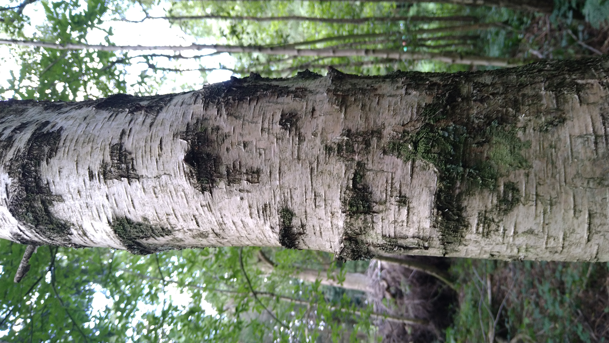

# Tensorflow-Simple-Tree-Recognition
With all the extra time during the initial lockdown I was able to spend more of it in nature and develop my knowledge about trees. Combining two of my favourite interests I wanted to make a simple tree identfication app using some of my favourite trees in my local woods. For this I decided to try to create my own dataset as it would help show me the challenges with data acquisition as well as processing. I selected 7 species to keep the potential label pool small, and when choosing the 7 I picked quite varied looking trees to make it easier for the identifier network. The species chosen were:
* Coastal Redwood
* Douglas Fir
* English Oak
* Japanese Larch
* Poplar
* Scots Pine
* Silver Birch

To create the dataset I took various photos with changing angles, time of day, weather, zoomed in, etc to get some variation in the dataset. I also tried to get a good spread of different ages of each tree so that the model could generalise a bit better to that certain species. The hardest step was placing each image in the correct label folder as this was very time consuming, ideally I would find a way to make this step more efficient. The photos all focused in on the bark of the trees.

Initially for the NN structure I tried out some of the famous architectures, mainly the AlexNet, this took a long time to run so I tweaked it a bit for quicker iteration time although with not so great accuracy.

As seen on the confusion matrix in the notebook - redwood, fir, pine, and birch are all quite distinctive and easy to recognise, but the NN struggles for oak, larch, pine, and poplar. The NN almost completley accurately predicts poplars as poplars but it also consistently mislabels oaks and larches as poplars aswell. Looking at photos of these trees it can be quite easy to see why, these have quite similar bark strucutres.

English Oak Example             |  Poplar Example
:-------------------------:|:-------------------------:
  |  

As you can see the oak and poplar have very similar bark patterns, with the main difference being the thickness and protrusion of the lines on the poplar bark

Scots Pine Example          |  Japanese Larch Example
:-------------------------:|:-------------------------:
  |  

Same again here they have very similar bark patterns with the pine having what to me looks more like "stuck on" strips whereas the larch bark strips appear to peel off since each one is a bit convex. 

After comparing these images it is very easy to see why the NN tripped up on these tree types. Compared to the very distinct other barks below, especially the colour and the "furiness" of the Coastal Redwood:

Douglas Fir Example          |  Coastal Redwood Example   |  Silver Birch Example
:-------------------------:|:-------------------------:|:-------------------------:
  |   |  

For both the sets of similar trees above they have very different canopies and leaf/needle shapes, which can be a more useful signifier of tree type when combined with the bark structure. Due to this I plan to expand the dataset to photos of the canopies and branches and training these images on another NN. The output for both this NN and the original one would instead be a confidentiality percentage instead of a label, and then combining the results of the two NNs would give a more accurate result.

At the end of the day this NN is nowhere near as accurate as a human identifier, but as talked above when I identify a tree I am taking a lot more in to account than just the bark, therefore the future goal should be adding some more useful indications to help the NN.

## Current issues with the data:
* Some species of tree have very varied bark depending on age of the tree eg the douglas fir. Getting a large enough amount of photos of the different stages is very important to accuratley identify this variation.

Young Douglas Fir          |  Older Douglas Fir
:-------------------------:|:-------------------------:
  |  

* There aren't any young poplars in the woods so this dataset wouldn't generalise very well to other woods with poplars.
* With the species chosen there is quite a large variation in tree bark structure which makes it a lot easier, the NN would struggle with similar looking species of tree.

The answer to these issues is mainly just gathering more data, so slowly over the coming term time holidays this will be possible. Also these images will be of varying seasons allowing the NN to generalise better.

## Next Steps:
* Take more photos for the dataset, hopefully this will greatly increase the NN performance.
* Further work developing the NN to enable better learning, reducing the overfitting whilst reataining the train set accuracy.
* As seen in the commented out sections of the code I want to try masking to removed backgrounds and the sky to try to focus the image by its bark, currently difficult since barks are such varying colours, and the background is also very varied.
* Add another network focusing on images of the canopy and then combining the percentage results from each network to get a better total accuracy for a combination of a picture of bark and a photo of the canopy.
* Create the application in which you can take a photo of a tree in these woods on your phone and it would identify it, with added features to Geo tag the tree for conservation research and with the potential to add notes about it, as well as including the users photos into the dataset and using these larger dataset to increase model accuracy.

